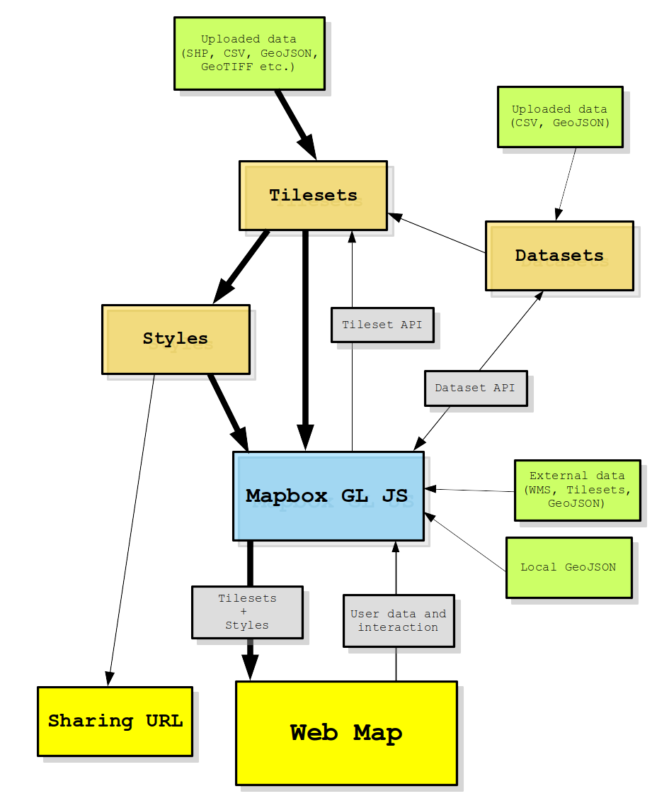

## Mapbox web mapping ecosystem

The figure below presents a simplified paths that you can take to create a web map using Mapbox. This get more complicated when we consider using SDKs and geospatial services.

